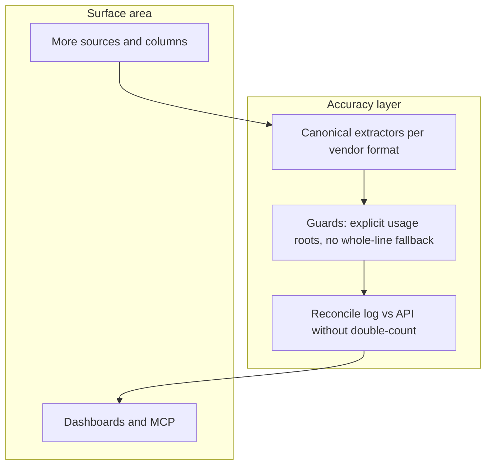
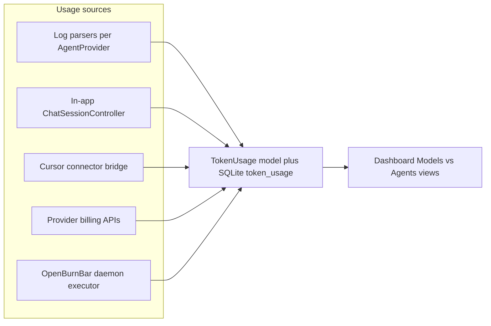

<!-- 0f370fce-50ba-42a4-b7c0-0c2a00e6474f -->
---
todos:
  - id: "research-matrix"
    content: "Write provider × source matrix: log paths, JSON keys, confidence, catalog/model aliases, external doc citations"
    status: completed
  - id: "fix-inapp-usage"
    content: "Persist TokenUsage for Codex, Claude, OpenClaw chat; resolve OpenClaw AgentProvider mapping"
    status: completed
  - id: "align-totals"
    content: "Unify totalTokens (and CLIUsageSnapshot) with cache read + documented reasoning handling; update aggregations/Firestore"
    status: completed
  - id: "optional-source-column"
    content: "usageSource + sync + dashboard/MCP + dedupe rules"
    status: completed
  - id: "catalog-refresh"
    content: "Expand BurnBarCatalog aliases/pricing from research; extend catalog tests"
    status: completed
  - id: "accuracy-codex-parity"
    content: "Single source of truth for Codex token JSONL (token_count vs OpenAI usage); strict exec stream parsing"
    status: pending
  - id: "accuracy-reasoning-merge"
    content: "Clamp completion−reasoning; avoid double-count in totals/cost; document API semantics"
    status: pending
  - id: "accuracy-stream-usage"
    content: "Multi-chunk SSE/JSONL: pick authoritative usage (max total or final); tests"
    status: pending
isProject: false
---
# Token usage tracking overhaul

## Product principle: accuracy over surface area

**North star:** Numbers should match **billable reality** (vendor usage objects, invoices) and **not** grow extra rows, columns, or sources unless they **improve correctness** or **explain confidence** (exact vs estimated).

- **Surface area** (more providers, more fields, more charts) is secondary if parsing is fuzzy, totals disagree, or the same tokens are counted twice.
- **Accuracy** means: one canonical normalization per vendor, shared extraction code where formats overlap, explicit handling of cache/reasoning/total semantics, and tests on golden payloads.

---

## Current architecture (baseline)

- **Schema:** [`OpenBurnBarDatabase.swift`](AgentLens/Services/DataStore/OpenBurnBarDatabase.swift) defines `token_usage` with `provider`, `sessionId`, `model`, token columns, `cost`, times, sync fields. Unique key: `(provider, sessionId, model, COALESCE(sourceDeviceId,''))` (see migration `v12` / device-aware index).
- **Harnesses (agent runtimes):** Represented by [`AgentProvider`](AgentLens/Models/AgentProvider.swift). Parsers are registered in [`UsageAggregator`](AgentLens/Services/UsageAggregator.swift) (~lines 146–171).
- **Models:** Raw `model` string plus [`TokenExtractionUtility.normalizeModelKey`](AgentLens/Services/LogParser/TokenExtractionUtility.swift); pricing via [`ModelPricing`](AgentLens/Services/ModelPricing.swift) + bundled [`BurnBarCatalog`](OpenBurnBarCore/Sources/OpenBurnBarCore/OpenBurnBarCatalog.swift).
- **Cloud sync:** [`CloudSyncService.encodeUsage`](AgentLens/Services/CloudSyncService.swift) mirrors fields to Firestore.

---

## Critical gaps discovered (original)

1. In-app chat persistence for non-Hermes backends (addressed in implementation pass).
2. `totalTokens` vs summaries / cache read alignment (addressed in implementation pass).
3. `CLIUsageSnapshot` and reasoning/cache semantics (addressed in implementation pass).
4. Reasoning as a first-class field vs folded into output (addressed with `reasoningTokens` + pricing).
5. Explicit `usageSource` for attribution (addressed in implementation pass).

---

## Phase A — Research deliverable

Produce and maintain **provider × source matrix** in [`docs/TOKEN_USAGE_SOURCES.md`](docs/TOKEN_USAGE_SOURCES.md): log paths, JSON keys, **exact vs estimated**, vendor doc links, catalog alias gaps.

Deliverable: prioritized list where **P0 = wrong or unstable numbers**, not “missing provider.”

---

## Phase B — Correctness and in-app coverage (shipped baseline)

Extended in-app persistence, `totalTokens` definition, `usageSource`, Firestore/MCP, catalog aliases. **If anything here regressed accuracy** (e.g. counting tokens twice), fix in Phase E first.

---

## Phase C — Harness attribution (shipped when needed)

`usageSource` and related plumbing—useful when it **separates** streams that would otherwise be confused; avoid duplicate session rows (document dedupe rules).

---

## Phase D — Catalog

Aliases and pricing only where they **reduce mis-priced rows**; tests in [`OpenBurnBarCatalogTests`](OpenBurnBarCore/Tests/OpenBurnBarCoreTests/OpenBurnBarCatalogTests.swift).

---

## Phase E — Accuracy hardening (primary follow-up; not more surface area)

**Goal:** Same or fewer user-visible dimensions, **better** alignment with vendor usage objects.

1. **Codex single source of truth**  
   - [`UsageAggregatorParsers.parseCodexSessionJSONL`](AgentLens/Services/UsageAggregatorParsers.swift) and [`CLIBridge.runCodexStream`](AgentLens/Services/CLIBridge.swift) must not diverge: extract shared helpers in [`TokenExtractionUtility`](AgentLens/Services/LogParser/TokenExtractionUtility.swift) for `event_msg` / `token_count` / `total_token_usage`.  
   - For `codex exec --json`, **do not** treat arbitrary JSON lines as OpenAI `usage` via `(usage ?? entireObject)` unless `usage` is explicitly present **or** the line matches Codex native `token_count` shapes (avoids false positives).

2. **Reasoning vs completion**  
   - After splitting `reasoning_tokens` from `completion_tokens`, clamp visible output: `max(0, completion - reasoning)`; document when APIs embed reasoning inside completion so totals match invoices.

3. **Streaming usage selection**  
   - Multiple `.usage` events per turn (SSE/JSONL): keep **authoritative** totals—e.g. prefer snapshot with largest `totalTokens`, or last event only when vendor guarantees final chunk carries full usage.

4. **Estimated providers (Copilot, Cursor, etc.)**  
   - Narrow the gap: tighten heuristics, label **estimated** clearly in UI, avoid presenting estimated USD as exact when `dataConfidence != .exact`.

5. **Tests**  
   - Golden JSON fixtures per vendor path; regression tests for `openAICompatibleUsage`, Codex envelopes, and `ChatSessionController` usage merge.

---

## Risk / compatibility notes

- **Firestore:** Changing meaning of `totalTokens` affects historical comparisons—document and optionally version aggregates.
- **Dedupe:** Same session must not appear twice from log + in-app unless intentionally reconciled.

---

## Suggested order (updated)

1. **Phase E accuracy hardening** (Codex parity, strict usage roots, reasoning clamp, stream merge, tests).  
2. Phase A doc refresh when E changes behavior.  
3. Phase D catalog only where pricing mismatches are proven.  
4. Phase C UI filters only when attribution is needed to **disambiguate** duplicate-looking totals—not for vanity breakdowns.
